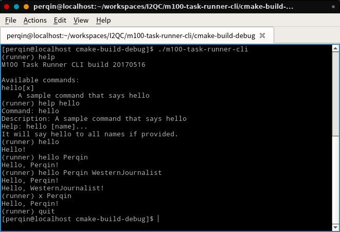

# m100-task-runner-cli
Command line flight task runner for M100 rewritten with plain C++.

## Usage

### Build and Run

To build this project, GNU toolchain and CMake is required.

Build and run with CMake:

```shell
# Clone the source code
git clone https://github.com/SYSU-QuadCopter-2014-Team/m100-task-runner-cli.git
# Create build directory
mkdir m100-task-runner-cli_build
# And cd into the build directory
cd m100-task-runner-cli_build/
# Create Makefile with cmake
cmake ../m100-task-runner-cli/
# Make the project
make
# Run the executable
./m100-task-runner-cli
```

You will get the interactive CLI.

### Usage

Type `help` or `h` to get a list of available commands. Type `quit` or `q` to quit the application. Type the name or shortCut of a command shown in available commands list to run the command. To get help of a specific command, Type the name of the command followed by `help` command:

```
(runner) help hello
Command: hello
Description: A sample command that says hello
Help: hello [name]...
It will say hello to all names if provided.
```

There is a screenshot of the application.



## Contribute

This application accepts user input and run corresponding Command. You can contribute to this project by writing your own Command implementation.

### How to Contribute

To avoid breaking upstream code, you have to fork this repository first and commit your code to forked repository. After enough testing, fire a Pull Request to merge your commits onto this repository.

### How to Implement a Command

#### Command

In this application, each runnable unit is called a Command. Each Command has a unique `name` and an optional unique `shortCut`. `name` is a word containing only a-z, A-Z and 0-9. `shortCut` is a char, or `\0` if not available.

To run a Command, user simply type its `name` or `shortCut`. In the example below, `x` is the `shortCut` for Command `hello`.

```
(runner) hello
Hello!
(runner) x
Hello!
```

A Command can also receive `arguments` separated by white space.

```
(runner) hello Perqin
Hello, Perqin!
(runner) x Perqin WesternJournalist
Hello, Perqin!
Hello, WesternJournalist!
```

#### Implement a Command

To implement your own command, you have to inherit AbstractCommand. The following steps create a HelloCommand which will say hello.

First, create `hellocommand.h` under `inc`, and `hellocommand.cpp` under `src`.

Then, declare HelloCommand class in `hellocommand.h`:

```c++
#ifndef M100_TASK_RUNNER_CLI_HELLOCOMMAND_H
#define M100_TASK_RUNNER_CLI_HELLOCOMMAND_H

#include "abstractcommand.h"

class HelloCommand : public AbstractCommand {
public:
    virtual char getShortCut();

    virtual std::string getName();

    virtual std::string getDescription();

    virtual std::string getHelp();

    virtual bool isDependenciesMet(DependenciesManager &);

    virtual bool runTask(const std::vector<std::string> &arguments, DependenciesManager &, Sdk &);
};

#endif //M100_TASK_RUNNER_CLI_HELLOCOMMAND_H
```

Note that all virtual functions should be implemented except `isDependenciesMet`, which provides default implementation.

Next, head to `helloworld.cpp` to define the name, shortCut and other details of the command:

```c++
#include "hellocommand.h"

#include <iostream>

char HelloCommand::getShortCut() {
    return 'x';
}

std::string HelloCommand::getName() {
    return "hello";
}

std::string HelloCommand::getDescription() {
    return "A sample command that says hello";
}

std::string HelloCommand::getHelp() {
    return "hello [name]...\nIt will say hello to all names if provided.";
}
```

The description will be shown on the command list screen and is recommended to be less than 80 characters. The help text should provide the usage of this command.

Finally, implement `runTask` function. In this case, we just print the greetings with `std::cout`. Return value indicates whether this command is executed successfully.

```c++
bool HelloCommand::runTask(const std::vector<std::string> &arguments, DependenciesManager & dependenciesManager, Sdk & sdk) {
    if (arguments.size() == 0) {
        std::cout << "Hello!" << std::endl;
    } else {
        for (auto argument : arguments) {
            std::cout << "Hello, " << argument << "!" << std::endl;
        }
    }
    return true;
}
```

Note that you can also update the dependencies with the `dependenciesManager` argument, and invoke pre-defined SDK functions with the `sdk` argument. These will be mentioned below.

Finally, you have to register your command. Edit `src/commands.cpp`:

```c++
void Commands::registerCommands(std::vector <AbstractCommand*> & commands) {
    commands.push_back(new HelloCommand);  // Add this line
    // Other command registration...
}
```

You don't need to add extra code to `delete` your command instance, as the application will do it for you.

Now you can test your command!

#### About Dependency

Some commands may be available only when some condition is met. For example, all commands that call DJI Onboard SDK are available only when the application activates the SDK and obtains the control.

A Dependency is simply a integer. You can define a Dependency in `dependencies.cpp`:

```c++
void Dependencies::registerDependencies(std::vector<int> & dependencies) {
    // DJI OnboardSDK
    dependencies.push_back(0);
}
```

Then, you are able to tell the application whether your command is available:

```c++
bool TakeoffCommand::isDependenciesMet(DependenciesManager & dependenciesManager) {
    return dependenciesManager.isDependencyMet(0);
}
```

You can also update the dependencies! For example, a activate command will update the dependency:

```c++
bool ActivateCommand::runTask(const std::vector<std::string> &arguments, DependenciesManager & dependenciesManager, Sdk & sdk) {
    // Other works...
    dependenciesManager.addDependency(0);
    return true;
}
```

## Bugs Report

If you find any bugs or problems, create an issue in this repository. Please provide as much information as possible, such as the error output, the environment (OS, build tools. etc.) of your develop machine and production machine, how to reproduce the problem.